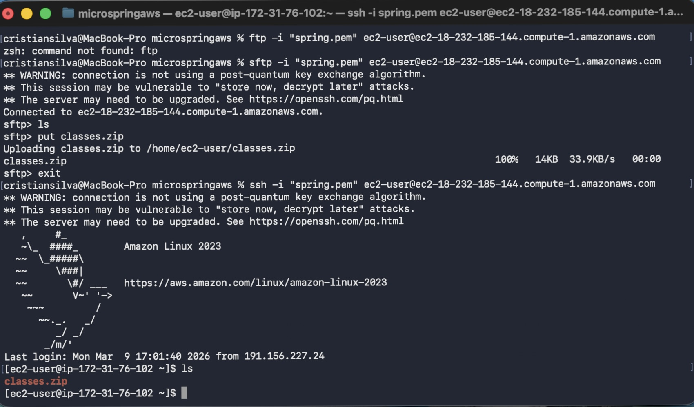
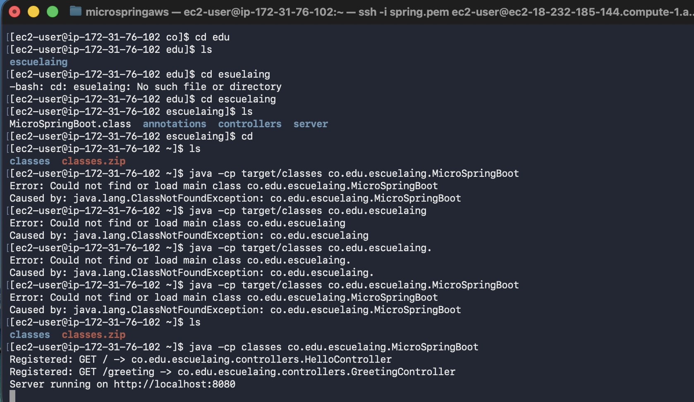
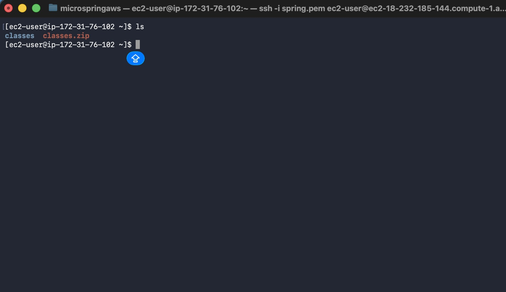
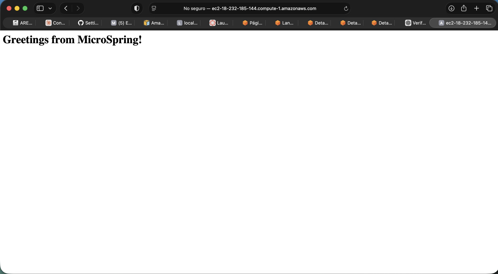
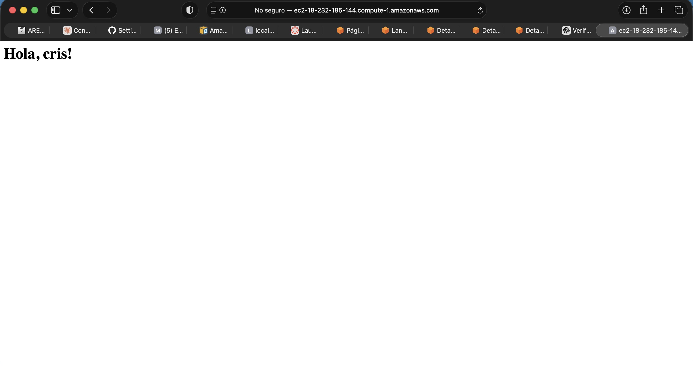

# Microframework Java (estilo Spring Boot)

Este proyecto implementa un microframework HTTP en Java usando sockets y reflexión, inspirado en conceptos básicos de Spring Boot.

Permite:

- Declarar controladores con `@RestController`.
- Registrar rutas GET con `@GetMapping`.
- Recibir parámetros de consulta con `@RequestParam` y valor por defecto.
- Descubrir controladores automáticamente escaneando el classpath.

## Lo que se implementó

Se desarrollaron los siguientes componentes principales:

- `MicroSpringBoot`: punto de entrada de la aplicación.
- `HttpServer`: servidor HTTP básico que escucha en el puerto `8080`, enruta solicitudes y construye respuestas.
- Anotaciones personalizadas:
	- `@RestController`
	- `@GetMapping`
	- `@RequestParam`
- Controladores de prueba:
	- `HelloController` con ruta `/`
	- `GreetingController` con ruta `/greeting?name=...`

## Estructura del proyecto

```text
src/main/java/co/edu/escuelaing/
|- MicroSpringBoot.java
|- annotations/
|  |- RestController.java
|  |- GetMapping.java
|  |- RequestParam.java
|- controllers/
|  |- HelloController.java
|  |- GreetingController.java
|- server/
	 |- HttpServer.java
```

## Requisitos

- Java 21
- Maven 3.x

## Como compilar y correr

1. Compilar el proyecto:

```bash
mvn compile
```

2. Ejecutar la clase principal con classpath:

```bash
java -cp target/classes co.edu.escuelaing.MicroSpringBoot
```

3. Probar en navegador o con `curl`:

```bash
curl "http://localhost:8080/"
curl "http://localhost:8080/greeting"
curl "http://localhost:8080/greeting?name=Cristian"
```

## Endpoints disponibles

- `GET /` -> retorna `"<h1>Greetings from MicroSpring!</h1>"`
- `GET /greeting?name=TuNombre` -> retorna `"<h1>Hola, TuNombre!</h1>"`
- Si no se envía `name`, usa el valor por defecto `World`.

## Evidencia

### Imagen 1



### Imagen 2



### Imagen 3



### Imagen 4



### Imagen 5



